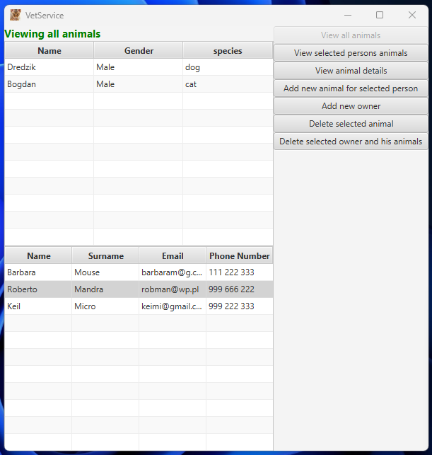
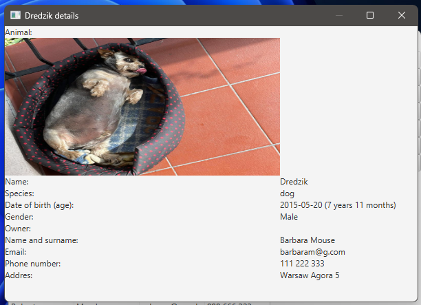

# VetService 
## description
VetService is a project to practice Java database operations and Java itself. It is a program that can be used by veterinarians to store information about patients and their owners. 
## sample views of the program

